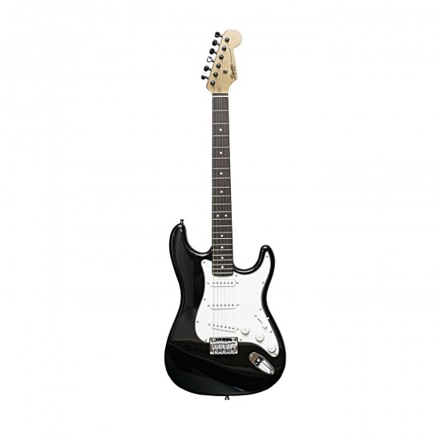

<head>
	<title>GuitarGeekz</title>
    <!-- CSS Stylesheets -->
  <link rel="stylesheet" href="https://maxcdn.bootstrapcdn.com/bootstrap/4.0.0/css/bootstrap.min.css" integrity="sha384-Gn5384xqQ1aoWXA+058RXPxPg6fy4IWvTNh0E263XmFcJlSAwiGgFAW/dAiS6JXm" crossorigin="anonymous">

  <!-- Font Awesome -->
  

  <!-- Bootstrap Scripts -->
  
  
  

 <link rel="icon"  href="icon.ico">
<link rel="stylesheet"  href="https://github.com/Himanshu8238/guitargeekz/blob/master/styles.css">

</head>
<body>
	
<section class="parttwo">
     

          
 
      	    <h1> Sorry Our Website is Closed </h1>
            <em>
As we are improving the website for a better experience
</em>
        
          

      

  </section>
      

      
  

<section class="partone">
		

	</section>

<section class="footer">
	

		<a style="color: black;" href="https://bit.ly/channel_himanshujain">
	       <i class="fab fa-youtube"></i>
	    </a>
	    <a style="color: black;" href="https://bit.ly/channel_himanshujain" >
      <i class="social-icon fab fa-twitter"></i>
  </a>

      
  Copyright 2020 GuitarGeekz

      
 This website is proudly made by Himanshu Jain

      

</section>
</body>
'''
